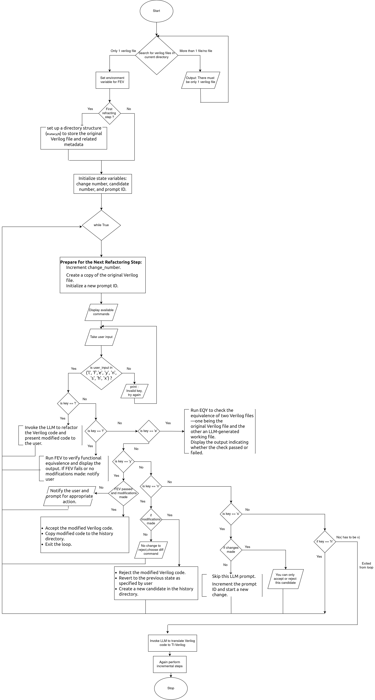

# Semi-automated Conversion from Verilog to TL-Verilog Using LLMs

## Goal

To use LLMs and TL-Verilog to improve all existing Verilog by reducing its size, improving its maintainability, making it more configurable, and identifying bugs? How could we possibly do all that? Transaction-Level Verilog (TL-Verilog) models are smaller, cleaner, and less bug-prone than their Verilog counterparts. But there's not much TL-Verilog in the wild yet. Advancements in AI make it feasible to automate the process of converting existing Verilog models to TL-Verilog.

If you ask ChatGPT to convert your code today, you won't be happy with the results. But with a thoughtful approach, LLMs can help. Through a series of incremental conversion steps, backed by formal verification, automated conversion is possible, and the results will have better quality than without LLM, especially when it comes to preserving meaningful comments.

## Approach

We aim to use existing LLMs, primarily various versions of ChatGPT via its API. We do not intend to tune a custom LLM (though that might be an option). The LLM will be trained through the conversation, primarily using "system messages".

A command-line Python script (`convert.py`) controls the interactions with the LLM. The script uses a recipe for conversion that includes numerous incremental conversion steps. The bulk of the process is refactoring Verilog to a form that looks similar to the (System)Verilog that would be produce by Redwood EDA's SandPiper(TM) tool. Each step:

- Provides the LLM with a "system message" that defines the nature of the conversion process and how to approach each step. (See `default_system_messages.txt`).
- Provide the prompt for the step and invoke the LLM to do all or part of the step.
- Extract the code from the LLM's response.
- Run FEV to test this code for correctness vs. the previous version of the code.
- If FEV passes
  - Update the code.
  - If the LLM indicated that it's update was incomplete, prompt again for more modifications and FEV, repeating until complete.
  - Move on to the next step, and repeat.

If any step in the process fails, the script will ask either the LLM or the human for assistance.

All updates performed by the script are captured in the file system so the script can be terminated and restarted, picking up where it left off. A complete history of changes is maintained with an ability to revert.

After refactoring the Verilog, the Verilog can be converted to TL-Verilog and refactored further.

This flow chart illustrates the conversion process provided by `convert.py`, though it should be taken with a grain of salt, as this is an actively-changing project, and this diagram may not be maintained.

## Status

The initial script is in place for the Verilog conversion steps.

## Ideas for Verilog Code Sources

- https://github.com/NVlabs/verilog-eval/blob/main/data/VerilogEval_Human.jsonl
- https://hdlbits.01xz.net/wiki/Main_Page
- A random Linkedin post that should be an easy conversion: https://www.linkedin.com/pulse/exploring-multiplication-structures-rtl-level-fpgas-stefanazzi-t0ajc%3FtrackingId=aC3MgfsoAaKippYXPY%252Fb1Q%253D%253D/?trackingId=aC3MgfsoAaKippYXPY%2Fb1Q%3D%3D
- RISC-V Cores
  - SERV
  - SweRV
  - cv32e40p
- Verilog libraries (These will be more difficult due to parameterization.)
  - BaseJump STL