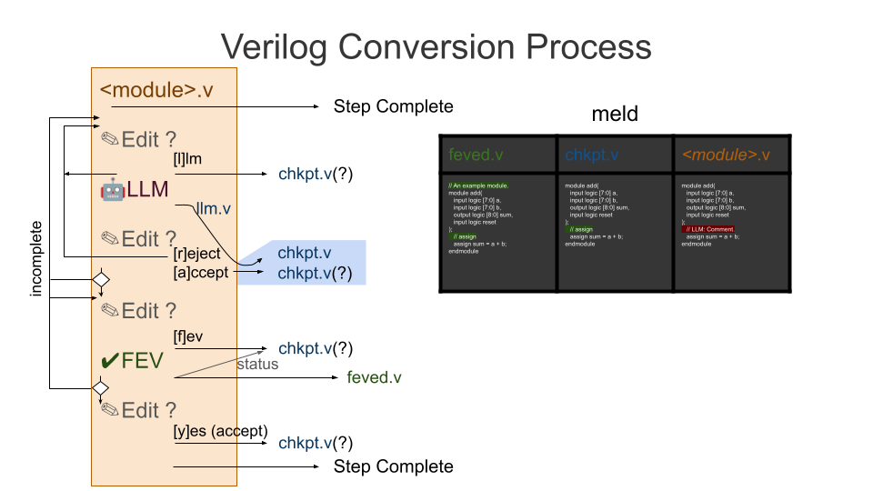

# Semi-automated Conversion from Verilog to TL-Verilog Using LLMs

## Goal

To use LLMs and TL-Verilog to improve all existing Verilog by reducing its size, improving its maintainability, making it more configurable, and identifying bugs? How could we possibly do all that? Transaction-Level Verilog (TL-Verilog) models are smaller, cleaner, and less bug-prone than their Verilog counterparts. But there's not much TL-Verilog in the wild yet. Advancements in AI make it feasible to automate the process of converting existing Verilog models to TL-Verilog.

If you ask ChatGPT to convert your code today, you won't be happy with the results[.](https://gitlab.com/rweda/Makerchip-public) But with a thoughtful approach, LLMs can help. Through a series of incremental conversion steps, backed by formal verification, automated conversion is possible, and the results will have better quality than without LLM, especially when it comes to preserving meaningful comments.

## Approach

We aim to use existing LLMs, primarily various versions of ChatGPT via its API. We do not intend to tune a custom LLM (though that might be an option). The LLM will be trained through the conversation, primarily using "system messages".

A command-line Python script (`convert.py`) controls the interactions with the LLM. The script uses a recipe for conversion that includes numerous incremental conversion steps. The bulk of the process is refactoring Verilog to a form that looks similar to the (System)Verilog that would be produce by Redwood EDA's SandPiper(TM) tool. Each step:

- Provides the LLM with a "system message" that defines the nature of the conversion process and how to approach each step. (See `default_system_messages.txt`).
- Provide the prompt for the step and invoke the LLM to do all or part of the step.
- Extract the code from the LLM's response.
- Run FEV to test this code for correctness vs. the previous version of the code.
- If FEV passes
  - Update the code.
  - If the LLM indicated that it's update was incomplete, prompt again for more modifications and FEV, repeating until complete.
  - Move on to the next step, and repeat.

If any step in the process fails, the script will ask either the LLM or the human for assistance.

All updates performed by the script are captured in the file system so the script can be terminated and restarted, picking up where it left off. A complete history of changes is maintained with an ability to revert. These files can later be used as training data for an LLM to improve the process.

After refactoring the Verilog, the Verilog can be converted to TL-Verilog and refactored further.

This flow chart illustrates the conversion process provided by `convert.py`. It is maintained as a Google Slide [here](https://docs.google.com/presentation/d/1DrzpY_SHGRrRTwy-Qn1yxRMDGkBcj451uwVKhUJ295I/edit?usp=sharing). (To update, request permission, edit, download as PNG and place in docs/VerilogConversionFlow.png.)



## Status

The initial script is in place for the Verilog conversion steps.

## Contributing

### Getting Started

Here are a few ideas to prepare for contributing:

- Use the learning resources in Makerchip to learn about TL-Verilog.
- Use the learning resources in Makerchip and https://github.com/rweda/M5 to learn M5, which is used to parameterize prompts.
- If you'd like to explore LLM-assisted visualization, use the learning resources in Makerchip to learn Visual Debug.
- Study the current prompts https://github.com/stevehoover/conversion-to-TLV/blob/main/prompts.json, capturing any thoughts.
- Choose some simple open-source Verilog modules to convert. Run the flow to convert them. Do not use the LLM. Make each change manually as if you are the LLM. Debug using FEV (run by the flow). Capture learnings.
- Get an OpenAI API key and convert more. Make incremental improvements along the way.

### Do Some Conversions

The intent is improve LLMs' ability to convert Verilog to TL-Verilog. We teach it through prompts. We convert. The conversion process captures what we've done. LLMs can train on this to become more savvy. Initially, there will be a lot of human guidance. Over time the LLMs become more capable.

## Conversion Examples

### By sharma-sugurthi
Repository: [TL-Verilog Conversion Examples](https://github.com/sharma-sugurthi/conversion-to-TLV)
- Basic circuits (D flip-flop, counter, 2-to-1 mux)
- Intermediate designs (shift register, traffic light controller)
- Sequence detector with state machine
- Detailed conversion steps and tutorials

So, where do we keep all this training data. Here are the current thoughts:
  - Fork this repo.
  - Do some conversions.
  - Push the history.
  - Do not create a pull request. You're repo will provide the training.
  - But, do push a reference to your repo to the main repo. See the [Conversions.md](./Conversions.md).

## Ideas for Verilog Code Sources

- https://github.com/NVlabs/verilog-eval/blob/main/data/VerilogEval_Human.jsonl
- https://hdlbits.01xz.net/wiki/Main_Page
- A random Linkedin post that should be an easy conversion: https://www.linkedin.com/pulse/exploring-multiplication-structures-rtl-level-fpgas-stefanazzi-t0ajc%3FtrackingId=aC3MgfsoAaKippYXPY%252Fb1Q%253D%253D/?trackingId=aC3MgfsoAaKippYXPY%2Fb1Q%3D%3D
- RISC-V Cores
  - SERV
  - SweRV
  - cv32e40p
- Verilog libraries (These will be more difficult due to parameterization.)
  - BaseJump STL

## API Key Generation for Gemini

You can obtain the free API key for Google Gemini via [AI Studio](https://aistudio.google.com/prompts/new_chat) by logging in or creating an account, then navigating to "Get API Key," reviewing the terms, and generating your key. Keep in mind that the free-tier key has rate limitations, so for higher usage, you may need to upgrade to a paid plan.

## Windows Support (WSL)

If you're using Windows, you can run the `convert.py` script via Windows Subsystem for Linux (WSL). Follow the instructions below to set it up:
1. **Install WSL**
   - Open the start menu and search for "Turn Windows features on or off".
   - Enable "Virtual Machine Platform" and "Windows Subsystem for Linux".
   - Save your work and restart the computer to apply the changes.
   - A new empty folder named "Linux" will be created in the file explorer.
   - Open Command Prompt (cmd) and update WSL by running:
     ```bash
     wsl --update
     ```
   - Verify the installation by checking the version:
     ```bash
     wsl --version
     ```
   - Repeat the update steps until you see:
     "The most recent version of Windows Subsystem for Linux is already installed."
2. **Install Ubuntu**
   - List available Linux distributions:
     ```bash
     wsl --list --online
     ```
   - Choose a distribution (e.g., Ubuntu-22.04) and install it:
     ```bash
     wsl --install --d Ubuntu-22.04
     ```
   - Enter new UNIX username and password and the operation will be completed successfully.
  
For a visual guide, check out this [installation tutorial](https://youtu.be/gTf32sX9ci0?si=YiCRS6dEqilfIrEv).
