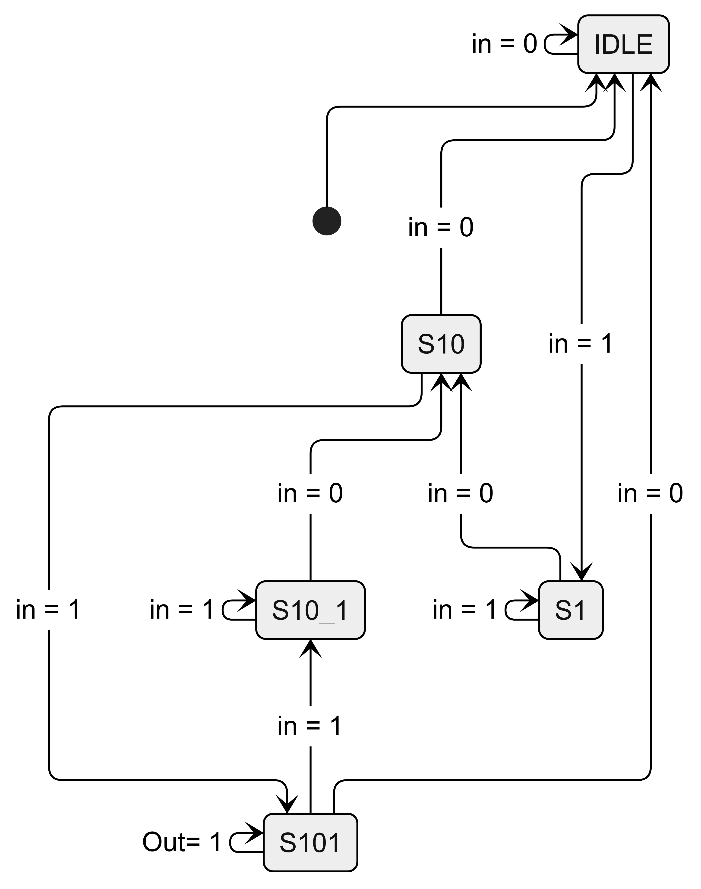

# Sequence Detector Conversion

This example demonstrates converting a sequence detector from Verilog to TL-Verilog. The detector looks for the pattern "101" in the input stream.


*Figure 1: State diagram showing the sequence detector's behavior*

## Original Verilog Code

```verilog
module sequence_detector (
   input wire clk,
   input wire rst_n,
   input wire in,
   output reg match
);

   // State encoding
   localparam IDLE    = 3'b000;  // Initial state
   localparam S1      = 3'b001;  // Found '1'
   localparam S10     = 3'b010;  // Found '10'
   localparam S101    = 3'b011;  // Found '101'
   localparam S10_1   = 3'b100;  // Found '10' and current input is '1'

   reg [2:0] state;
   reg [2:0] next_state;

   // State machine logic
   always @(posedge clk or negedge rst_n) begin
      if (!rst_n)
         state <= IDLE;
      else
         state <= next_state;
   end

   // Next state logic
   always @(*) begin
      case (state)
         IDLE:    next_state = in ? S1 : IDLE;
         S1:      next_state = in ? S1 : S10;
         S10:     next_state = in ? S101 : IDLE;
         S101:    next_state = in ? S10_1 : IDLE;
         S10_1:   next_state = in ? S10_1 : S10;
      endcase
   end

   // Output logic
   always @(posedge clk or negedge rst_n) begin
      if (!rst_n)
         match <= 1'b0;
      else
         match <= (state == S101);
   end

endmodule
```

## Conversion Steps

### 1. Three-space Indentation
- Applied standard three-space indentation
- Maintained readability of state machine logic

### 2. Clocking Analysis
- Single global clock input `clk`
- Used with `posedge` trigger
- No internal clock generation
- No gated or divided clocks

### 3. Reset Analysis
- Active-low reset signal `rst_n`
- Used asynchronously
- Will be converted to synchronous reset

### 4. State Machine Analysis
- Five states: IDLE, S1, S10, S101, S10_1
- Clear state encoding
- Well-defined state transitions
- Single output signal

### 5. Reset Signal Handling
- Convert to synchronous reset
- Maintain state machine functionality
- Preserve timing relationships

## TL-Verilog Version

```tlv
\TLV_version 1d: tl-x.org
\SV
   module sequence_detector (
      input wire clk,
      input wire rst_n,
      input wire in,
      output reg match
   );
\TLV
   // Connect inputs:
   $reset = ~ *rst_n;
   $in = *in;
   
   // State machine logic using |state_machine: notation
   |state_machine: IDLE, S1, S10, S101, S10_1
   
   // State transitions using ternary operators
   $State[2:0] =
        $reset ? IDLE :
        // State transitions
        ($State == IDLE && $in) ? S1 :
        ($State == S1 && !$in) ? S10 :
        ($State == S1 && $in) ? S1 :
        ($State == S10 && $in) ? S101 :
        ($State == S10 && !$in) ? IDLE :
        ($State == S101 && $in) ? S10_1 :
        ($State == S101 && !$in) ? IDLE :
        ($State == S10_1 && $in) ? S10_1 :
        ($State == S10_1 && !$in) ? S10 :
        //default
        $RETAIN;
   
   // Output logic
   $Match = ($State == S101);
   
   // Connect outputs (immediate)
   *match = $Match;
\SV
   endmodule
```


